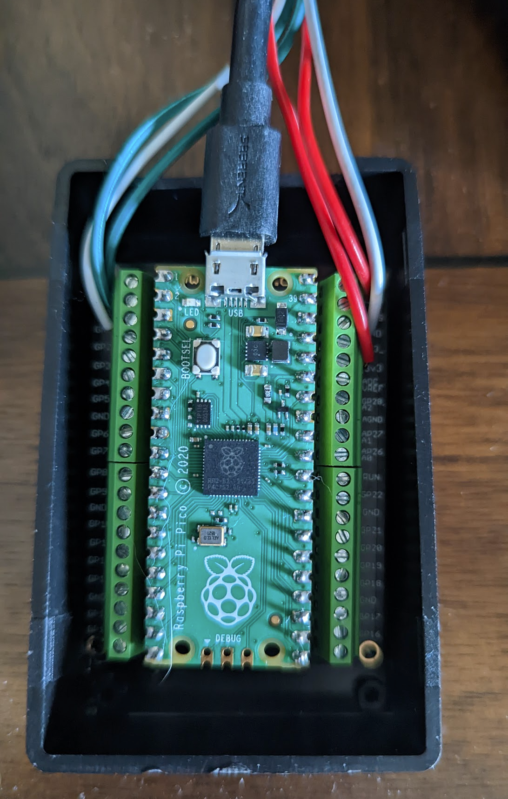
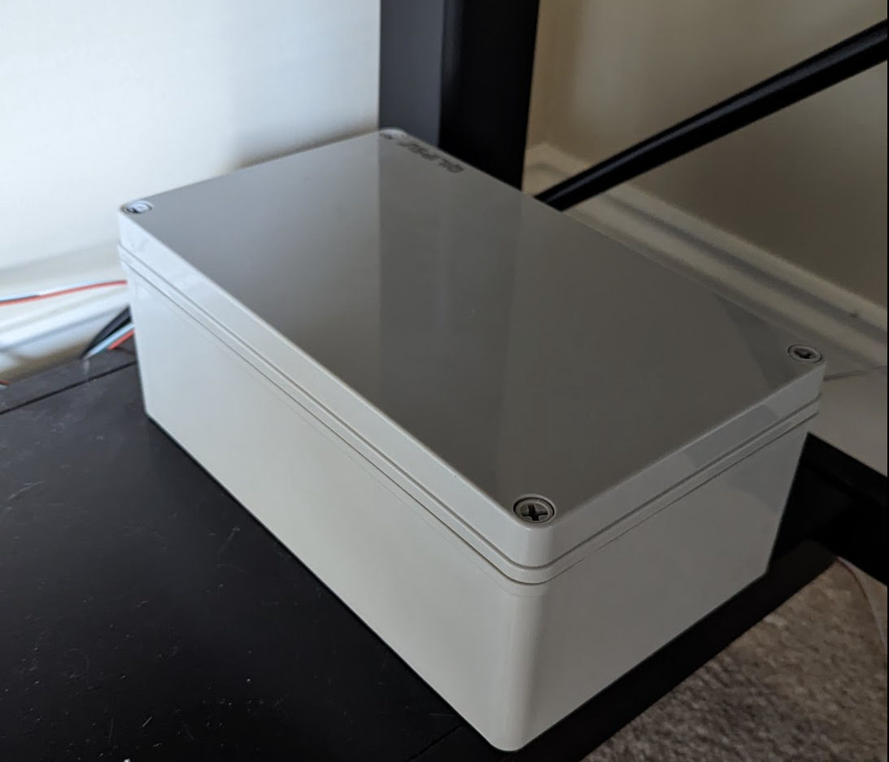
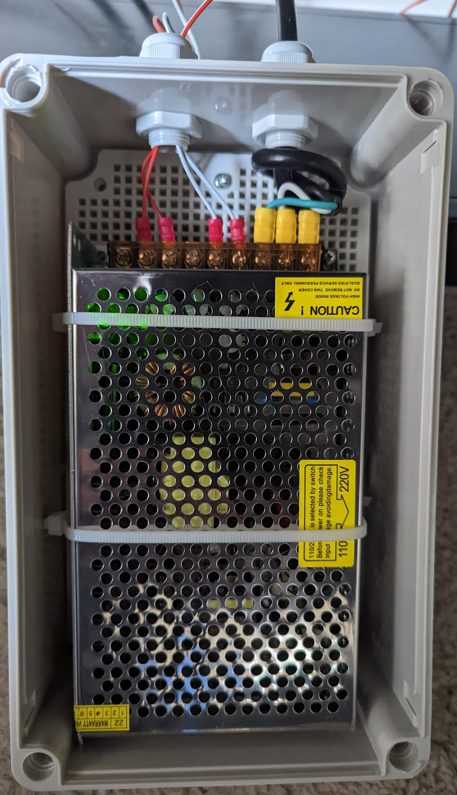
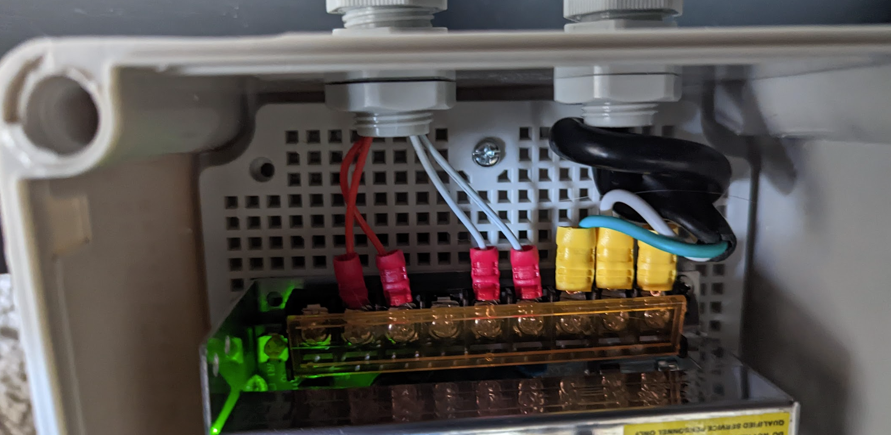
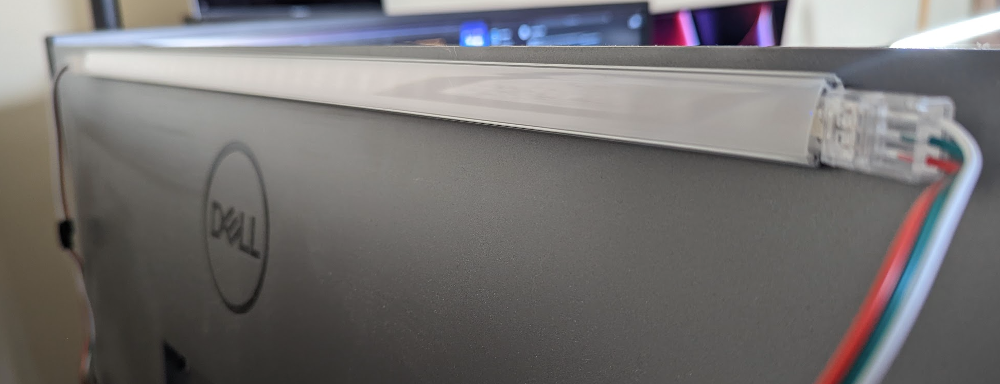

Raspberry Pi Pico-controlled collection of desk lights

# Overview

After so many ws2812b projects, I had lots of little strips left over.  So, I decided to use them to create some nice 
ambient lighting for my desk. 

# Technical Description

# Diagram 

# Pictures 

