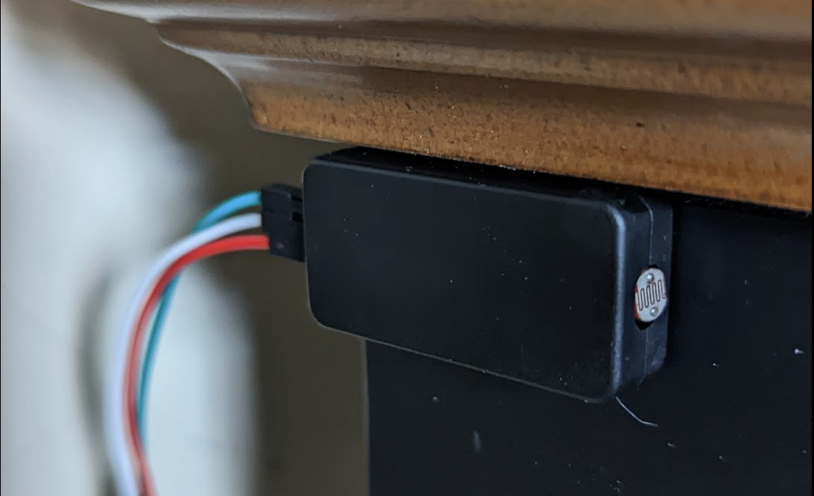

Raspberry Pi Pico-controlled collection of desk lights

# Overview

After so many ws2812b projects, I had lots of little strips left over.  So, I decided to use them to create some nice 
ambient lighting for my desk. 

# Technical Description

# Diagram 

# Parts List
1. pico
2. power supply
3. power chord
4. wires
5. ws2812b strip
6. ws2812b adapter plugs
7. ws2812b plastic strip connectors
8. aluminum strips w/light diffusers
9. light sensor
10. hobby box for pico
11. hobby box for light sensor
12. junction box for external power supply
13. "glands" for junction box
14. usb to micro usb connector (for software updates)
15. glue for light sensor
16. shrink tube wire connectors
17. female jumper wires (red, green, white)
18. mac usbc-to-usb connector (for software updates)
19. lighter (for shrink tubing)
20. wire stripper
21. wire clips
22. cable ties (to tie down power supply)
23. crimp wire connectors
24. crimping tool
25. 1/2" drill bit
26. drill (for holes in junction box)
27. pico adapter
28. soldering iron (to assemble the pico on the adapter)
29. solder 
30. wire clips (to tie down wires)
31. double-sided tape

# Assembly Notes

# Pictures 

